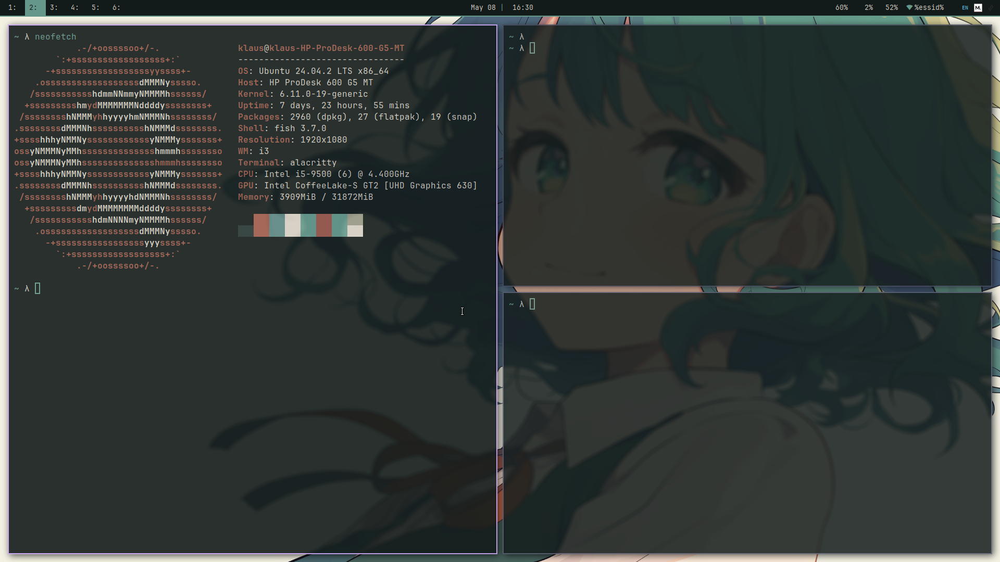

# i3 Window Manager Configuration

This directory contains my personalized i3 window manager configuration for Linux.

## Components

- **config**: Main i3 configuration file
- **cover.png**: Screenshot of my i3 desktop environment
- **lock-icon.png**: Icon used for the lock screen
- **scripts/lock.sh**: Script for locking the screen

## Features

- Custom keybindings for common applications
- Tailwind-inspired color scheme
- Gaps and smart borders
- Integrated with Rofi for application launcher
- Custom lock screen
- Media controls and brightness adjustment
- Workspace icons

## Dependencies

- i3-gaps
- Rofi
- Picom (compositor)
- Polybar
- Alacritty (terminal)
- Feh (wallpaper)
- i3lock-color
- JetBrainsMono Nerd Font
- playerctl (media controls)
- brightnessctl
- flameshot (screenshots)
- dunst (notifications)

## Installation

1. Clone this repository to `~/.config/i3/`
2. Make sure all dependencies are installed
3. Log out and select i3 as your window manager
4. Log in to apply the configuration

## Customization

Feel free to modify the `config` file to suit your preferences. The color scheme
can be adjusted by changing the color variables at the top of the configuration.